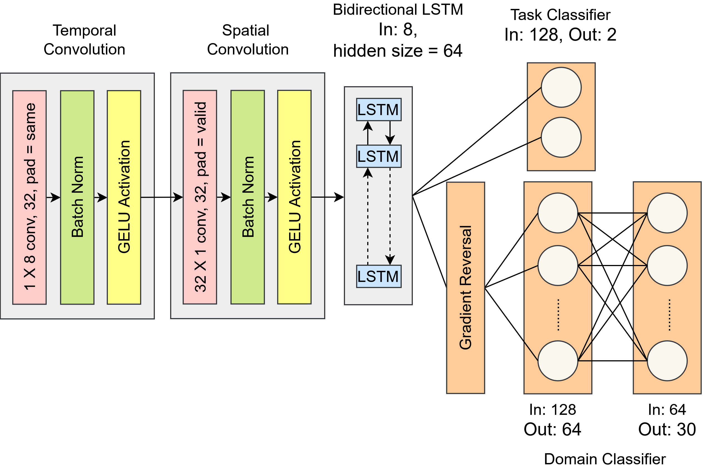

# EEG-Based Auditory Attention Detection (AAD) – ICASSP 2026 Track 1

This repository contains the code, preprocessing scripts, and trained models for EEG-based Auditory Attention Detection (AAD) for the ICASSP 2026 Grand Challenge.

## Data Preprocessing
### Train and Validation Data
1. Download the train/validation EEG and label data and move it into the project directory.
2. Run the preprocessing script:

```bash
python data_process_val_train.py
```

### Test data
1. Download the test EEG data and move it into the project directory.
2. Run the test preprocessing script:

```bash
python data_process.py
```

## Notebooks
1. **eeg_aad_track1_dann.ipynb** – Trains the model with Domain-Adversarial Neural Network (DANN) module for cross-subject generalization.

2. **eeg_aad_track1_lstm.ipynb** – Trains the model without the DANN module, using only LSTM for temporal dependencies.

3. **eeg-aad-track1-test.ipynb** – Computes subject-wise standard deviation and runs inference on the test set using the trained DANN model.

## Pretrained Models
1. **model_DANN.pth** – Contains the weights of our best-performing model (with DANN module).
2. **model_LSTM.pth** – Contains the weights of the model trained without the DANN module.

## Model Architecture



## Model Performance

| Model        | Dataset    | Accuracy (%) | Subject Std |
|--------------|------------|--------------|-------------|
| **With DANN**   | Validation | **56.09**      | 0.0380      |
| **With DANN**   | Test       | **53.65**      | 3.19        |
| Without DANN | Validation | 49.40        | 0.0371      |
| Baseline     | Validation | 53.1         | n/a         |
| Baseline     | Test       | 49.63        | 2.89        |

